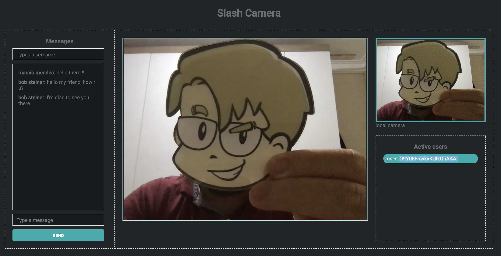

# Slash Camera

- Simple Chat app using nodejs and WebRTC.

  
Just play around with WebRTC

  

## What I've learned

- I learned about socket communication
- Learn how to play with WebRTC too ([they have awesome docs](https://webrtc.github.io/samples/))

## How to test this implementation

In the project directory, you can run:

- `yarn`: Intalling dependencies
- `yarn dev` : Start in development mode
- `browser tabs`: open the browser tabs to see all the things in action

Runs the app in the development mode. 
Open [http://localhost:3000](http://localhost:3000) to view it in the browser.

> Warning: This is only an example app, with a lot of references, just to play around WebRTC and understand the video meet process

## Built With

- [WebRTC](https://webrtc.org/) - Real-time communication for the web
- [Express](http://expressjs.com/) - Fast, unopinionated, minimalist web framework for **nodejs**.
- [Nodemon](https://nodemon.io/) - reload, automatically
- [EJS](https://github.com/mde/ejs) - Embedded Javascript Templates.

## Author

- **Marcio Mendes** - [mmendesas](https://github.com/mmendesas)

## References
  - [WebRTC samples](https://webrtc.github.io/samples/)
  - [Getting started with WebRTC](https://www.html5rocks.com/en/tutorials/webrtc/basics/)
